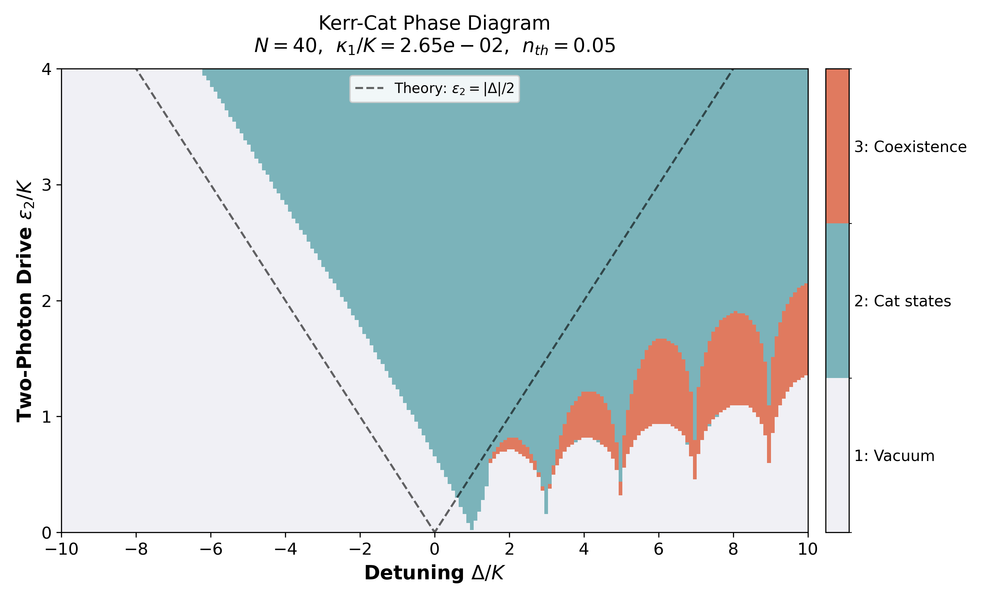
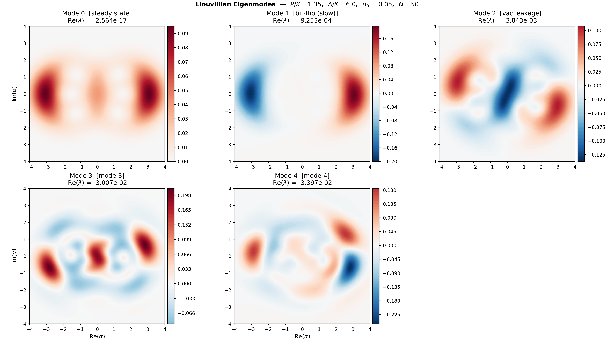
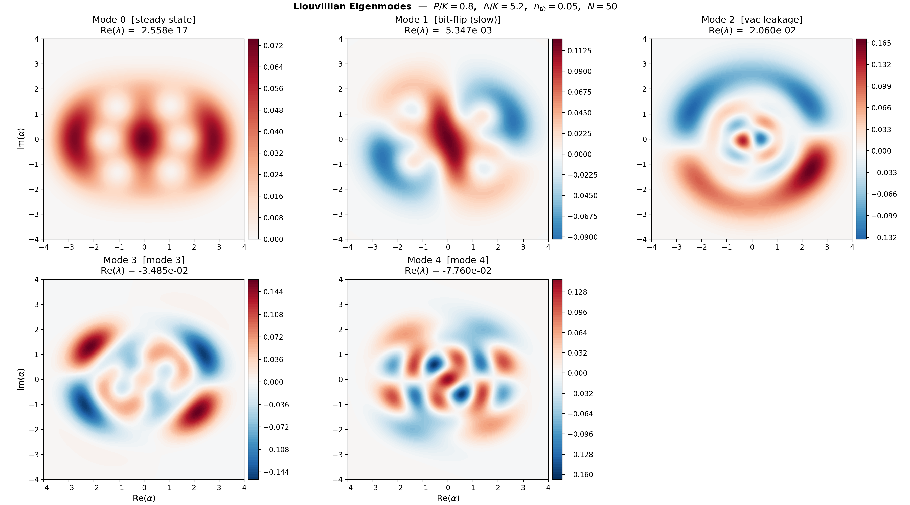
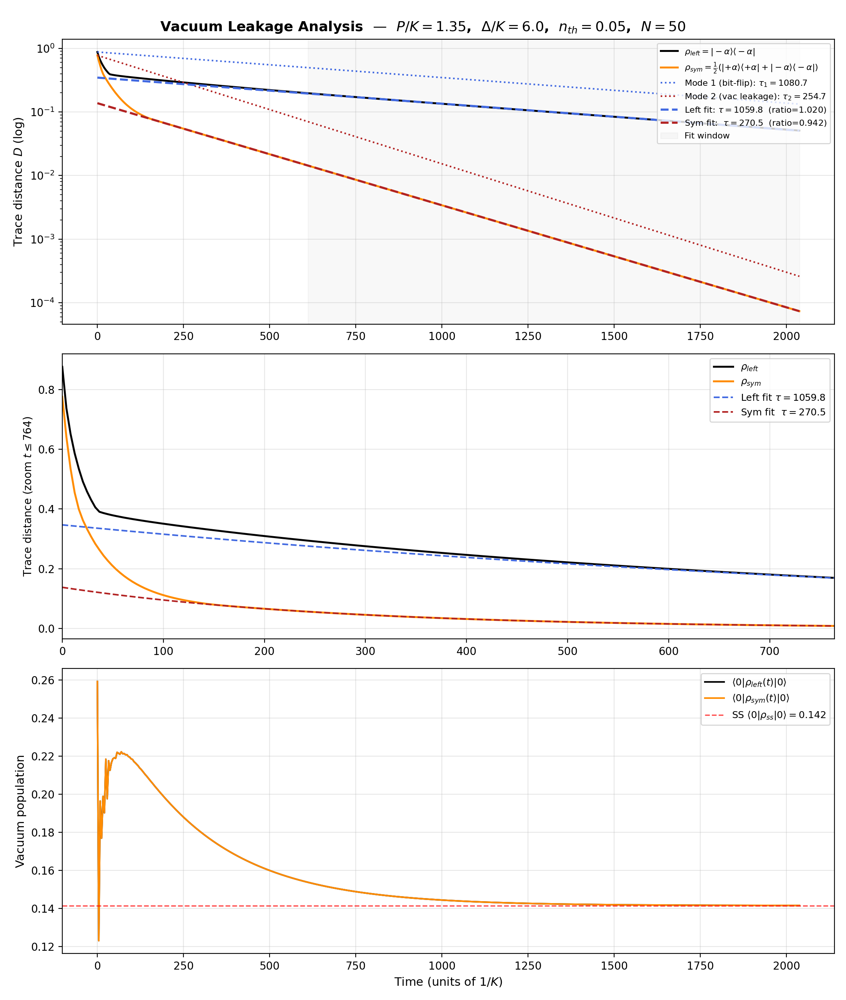
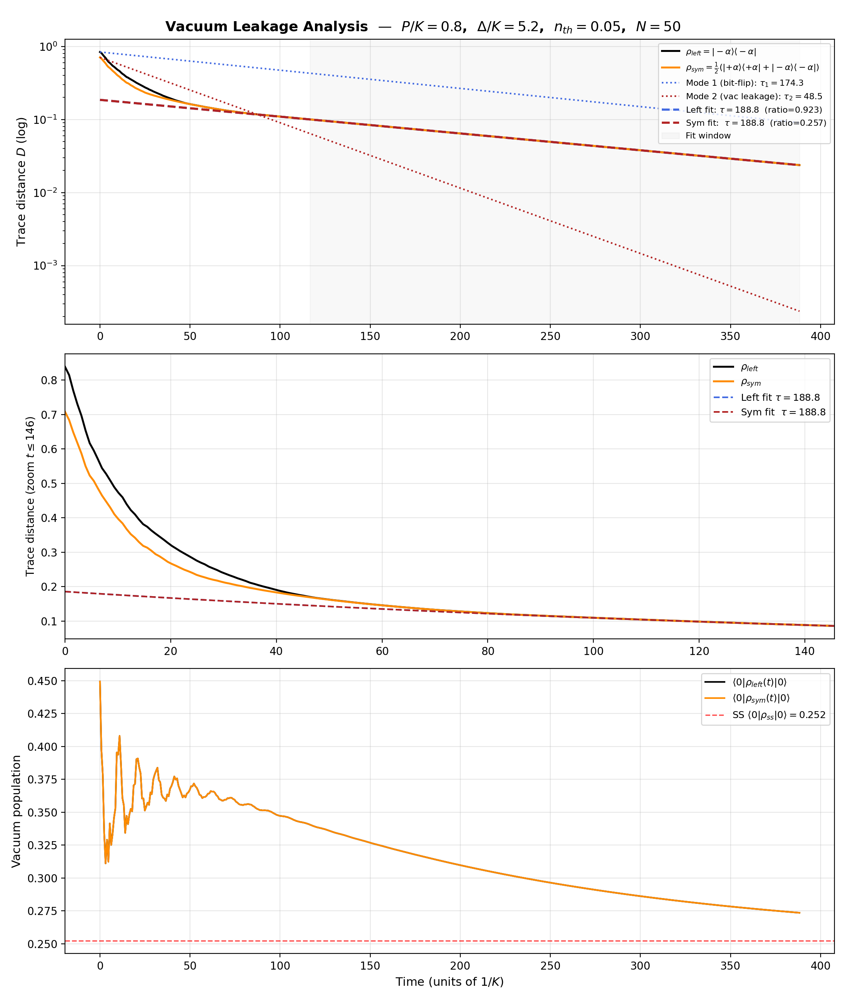
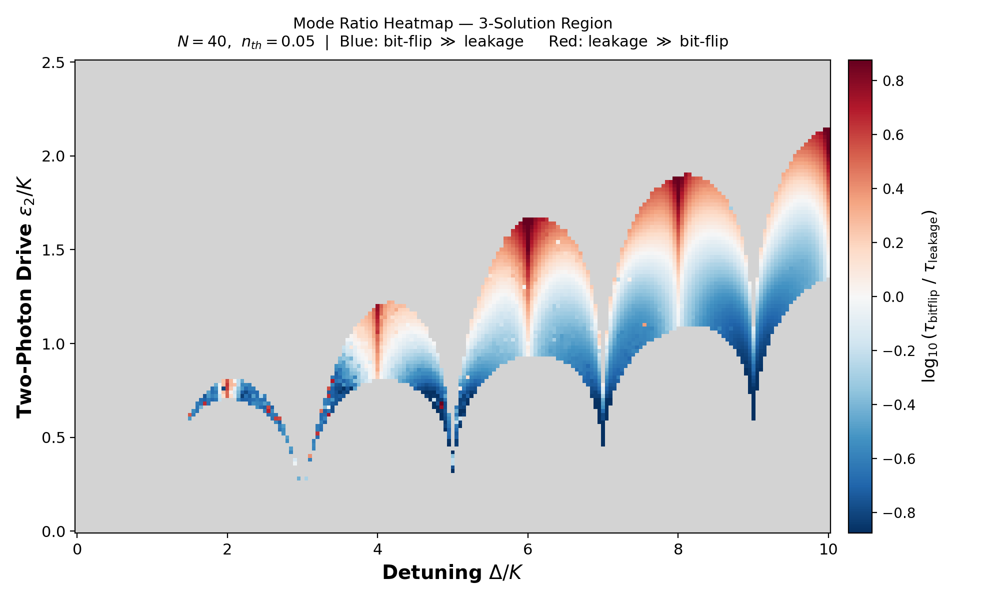

# Delta-Kerr-Cat Qubit: A Computational Study of Phase Structure, Dissipative Eigenmodes, and Coherence Timescale Separation

**Author:** Yoav P.
**Course:** MSc Semester 1 — Quantum Agents
**Date:** 2026-03-31
**Codebase:** `Delta-Kerr-Cat-Final/` — class-based QuTiP simulation suite

---

## Abstract

The Kerr-cat qubit is a bosonic quantum error-corrected qubit formed by confining a nonlinear oscillator to a two-dimensional cat-state manifold via a two-photon parametric drive. This work presents a full computational characterization of the detuned Kerr-cat (Delta-Kerr-Cat) system across the (P/K, Δ/K) parameter plane. We identify the three-solution coexistence region where both cat states and the vacuum coexist as attractors, compute the Liouvillian eigenmodes governing the approach to steady state, quantify vacuum leakage timescales via direct time evolution, and produce a parameter-space map of the ratio τ_bitflip / τ_leakage — the fundamental figure of merit for qubit quality. A novel mode classification discriminator based on the expectation value of the annihilation operator is derived and implemented, allowing automated, physics-motivated assignment of each Liouvillian eigenmode to either the bit-flip or leakage channel.

---

## 1. Physical System

### 1.1 Hamiltonian

The Kerr-cat qubit is described by the dimensionless Hamiltonian (normalised by K):

$$\frac{H}{K} = -\hat{a}^{\dagger 2}\hat{a}^2 + \frac{P}{K}\left(\hat{a}^2 + \hat{a}^{\dagger 2}\right) + \frac{\Delta}{K}\,\hat{a}^{\dagger}\hat{a}$$

where:
- **K** — Kerr nonlinearity (self-Kerr coefficient), sets the energy scale
- **P** — two-photon drive amplitude (parametric squeezing pump)
- **Δ** — cavity detuning from the pump's half-frequency

The three terms respectively encode:
1. **Kerr nonlinearity**: creates an energy-dependent frequency shift, making the oscillator anharmonic. This is the resource that makes the cat states stable attractors.
2. **Two-photon drive**: coherently injects photon pairs, stabilising the system in superpositions of ±α coherent states.
3. **Detuning**: shifts the resonance, deforming the cat-state manifold and crucially opening a three-solution regime where the vacuum coexists with the cat states.

The cat-state amplitude is set by the balance of drive and nonlinearity: **α = √(P/K)**.

### 1.2 Collapse Operators (Open Quantum System)

The cavity is coupled to a thermal bath at temperature T. In the Lindblad formalism, this produces two collapse operators (normalised by K):

$$c_1 = \sqrt{\frac{\kappa_1 (1 + n_{th})}{K}}\,\hat{a} \quad \text{(photon loss)}$$

$$c_2 = \sqrt{\frac{\kappa_1 n_{th}}{K}}\,\hat{a}^{\dagger} \quad \text{(thermal excitation)}$$

with physical parameters: **K = 1.2 MHz**, **κ₁ = 0.2 MHz**, **n_th = 0.05** (thermal photon occupancy).

### 1.3 Lindblad Master Equation

The density matrix evolves according to:

$$\dot{\rho} = \mathcal{L}[\rho] = -i[H, \rho] + \sum_k \left( c_k \rho c_k^\dagger - \frac{1}{2}\{c_k^\dagger c_k, \rho\} \right)$$

where L is the **Liouvillian superoperator** — a linear map on density matrices. Because ρ is an N×N matrix, L is an N²×N² matrix. Its eigendecomposition directly reveals all relaxation timescales of the system.

---

## 2. Phase Space Diagram

### 2.1 Method: Q-Function Peak Counting

The phase diagram maps, for each (P/K, Δ/K) point, the number of distinct stable attractors. We compute the **Husimi Q-function**:

$$Q(\beta) = \frac{1}{\pi}\langle\beta|\rho_{ss}|\beta\rangle$$

where ρ_ss is the steady-state density matrix and β spans a grid in the complex plane. The number of peaks in Q(β) is counted using `scipy.ndimage` blob detection, yielding:
- **1 peak** — single attractor (either pure cat state or pure vacuum)
- **2 peaks** — cat-state manifold only (two-lobe Wigner cat)
- **3 peaks** — three-solution regime (two cat lobes + vacuum lobe coexist)

The full grid scan is parallelised via Python's `multiprocessing.Pool`, with each (P, Δ) point processed by an independent worker.

### 2.2 Phase Diagram Result



**Figure 1.** Phase diagram in the (Δ/K, P/K) plane. Three distinct regions are visible:
- **Low Δ, moderate P**: Two-solution cat regime — the system locks into the cat-state manifold.
- **Low P**: Vacuum-dominated regime — drive too weak to stabilise cat states.
- **Wave-shaped islands at large Δ**: Three-solution coexistence — both cat states and the vacuum are simultaneously stable. This is the most interesting regime for qubit physics, as it introduces a leakage channel to vacuum alongside the desired bit-flip protection.

The irregular, island-like shape of the three-solution boundary arises from the resonance structure of the detuned Hamiltonian: at certain Δ/K values, higher Fock states become resonant with the drive, creating windows of enhanced mixing between the cat manifold and vacuum.

---

## 3. Liouvillian Eigenmodes

### 3.1 Eigendecomposition of L

The Liouvillian superoperator satisfies:

$$\mathcal{L}[R_k] = \lambda_k R_k$$

where Rk are **eigenmatrices** (operators on Hilbert space) and λk are complex eigenvalues. Key properties:
- **Mode 0**: λ₀ = 0 — the steady state ρ_ss. Always present by conservation of probability.
- **Mode k ≥ 1**: Re(λk) < 0 — decaying modes with lifetime **τk = 1/|Re(λk)|**.

Modes are sorted by |Re(λ)| ascending so that the slowest decaying modes (longest lifetimes) come first. The two slowest non-zero modes encode the qubit's characteristic timescales.

We compute the 6 slowest eigenvalues using `scipy.sparse.linalg.eigs` with `sigma=0` (shift-invert around zero), which finds eigenvalues closest to the origin — precisely the slowest modes.

### 3.2 Wigner Function Visualisation

The eigenmatrices Rk are visualised via their **Wigner function** W(x, p), a phase-space quasi-probability distribution that can take negative values (quantum signature). The structure of W reveals the physical character of each mode.

**Operating point: P/K = 1.35, Δ/K = 6.0** (canonical three-solution point)



**Figure 2.** Wigner functions of the 5 slowest Liouvillian eigenmodes at P/K=1.35, Δ/K=6.0, N=50.

- **Mode 0** (τ→∞): The steady-state density matrix — two positive lobes at ±α with a small central component near vacuum. This is the long-time attractor.
- **Mode 1** (τ ≈ 1080/K): **Antisymmetric** — positive lobe at +α, negative lobe at −α. This is the **bit-flip mode**: it describes the difference |+α⟩⟨+α| − |−α⟩⟨−α|. Its long lifetime is the bit-flip protection time T_X.
- **Mode 2** (τ ≈ 254/K): **Symmetric with central dip** — equal positive weight at ±α and negative central weight. This is the **leakage mode**: it describes relaxation from the cat manifold toward vacuum, encoded as |+α⟩⟨+α| + |−α⟩⟨−α| − c|0⟩⟨0|.
- **Modes 3, 4** (τ ≈ 50–55/K): Fast intra-manifold relaxation — fine structure within the cat manifold.

**Operating point: P/K = 0.8, Δ/K = 5.2** (weaker drive)



**Figure 3.** Wigner functions at P/K=0.8, Δ/K=5.2. The cat amplitude is smaller (α=√0.8≈0.894). Notably, the mode **ordering is inverted** relative to the canonical point: Mode 1 is now **symmetric** (leakage mode, τ≈174/K) and Mode 2 is **antisymmetric** (bit-flip mode, τ≈48/K). The leakage channel is slower than the bit-flip channel — an unusual regime where the qubit leaks out of the cat manifold more slowly than it flips between cat states. This gives log₁₀(τ_bitflip/τ_leakage) = log₁₀(48/174) ≈ −0.56 — a negative value, appearing blue in the heatmap (Figure 6), indicating poor bit-flip protection relative to leakage at this operating point.

---

## 4. Vacuum Leakage Analysis

### 4.1 Time Evolution Protocol

To directly measure the bit-flip and leakage timescales experimentally-analogously, we perform **mesolve** time evolution from two carefully chosen initial states:

**State A** — asymmetric initial state (one cat lobe):
$$\rho_A(0) = |-\alpha\rangle\langle-\alpha|$$

This state has overlap with *both* Mode 1 and Mode 2. Its trace distance from ρ_ss decays as a superposition of both rates, but Mode 1 (bit-flip) dominates at long times.

**State B** — symmetric initial state (equal cat mixture):
$$\rho_B(0) = \frac{1}{2}\left(|+\alpha\rangle\langle+\alpha| + |-\alpha\rangle\langle-\alpha|\right)$$

This state is symmetric under α → −α. By construction, its overlap with Mode 1 (antisymmetric) is exactly zero. The trace distance from ρ_ss decays purely with **Mode 2 (leakage)** rate.

### 4.2 Timescale Extraction

The trace distance D(ρ(t), ρ_ss) = ½||ρ(t) − ρ_ss||₁ is fitted in the late-time window with:

$$D(t) \approx A_1 e^{-t/\tau_1} + A_2 e^{-t/\tau_2}$$

using `scipy.optimize.curve_fit`. For the symmetric initial state, A₁ ≈ 0 by symmetry, so the fit simplifies to a single exponential extracting τ₂.

### 4.3 Results at Canonical Point (P/K = 1.35, Δ/K = 6.0)



**Figure 4.** Leakage analysis at P/K=1.35, Δ/K=6.0, N=50.
- **τ₁ = 1080.7/K** (bit-flip time): Starting from |−α⟩, the trace distance at long times decays with this rate — confirmed to match Mode 1 eigenvalue.
- **τ₂ = 254.7/K** (leakage time): Starting from the symmetric mixture, the trace distance decays purely with this rate — confirmed to match Mode 2 eigenvalue.
- The **early steep decay** (t = 0–30/K) in both curves is dominated by Modes 3 and 4 (fast intra-manifold), not Mode 2.

The ratio τ₁/τ₂ ≈ 4.24 at this point — bit-flip is ≈ 4× slower than leakage, indicating reasonable but imperfect protection.

### 4.4 Results at Second Point (P/K = 0.8, Δ/K = 5.2)



**Figure 5.** Leakage analysis at P/K=0.8, Δ/K=5.2.
- **τ₁ = 174.3/K** (slower mode), **τ₂ = 48.5/K** (faster mode).
- As confirmed by the Wigner functions (Figure 3), the mode ordering is **inverted** at this point: Mode 1 (τ₁=174.3/K) is the **leakage mode** (symmetric Wigner) and Mode 2 (τ₂=48.5/K) is the **bit-flip mode** (antisymmetric Wigner). The bit-flip lifetime is shorter than the leakage lifetime.
- This gives **τ_bitflip/τ_leakage = 48.5/174.3 ≈ 0.28**, i.e., log₁₀ ≈ −0.56 — a negative ratio, meaning this point would appear **blue** in the mode ratio heatmap (Figure 6): poor bit-flip protection.
- The symmetric fit quality is noticeably worse (fit ratio ≈ 0.257) because the timescales are close and the late-window single-exponential approximation breaks down.

---

## 5. Mode Ratio Heatmap

### 5.1 Motivation

A single operating point gives two numbers: τ_bitflip and τ_leakage. The fundamental question for engineering is: **across the full three-solution region, where is the ratio τ_bitflip / τ_leakage largest?** High ratio = long bit-flip protection relative to leakage = better qubit.

Rather than examining one point at a time, we map log₁₀(τ_bitflip / τ_leakage) across the entire parameter plane — but only where the system is in the three-solution regime (elsewhere the metric is undefined).

### 5.2 Two-Pass Algorithm

Computing Liouvillian eigenvalues at every grid point would be prohibitively expensive. Instead, we use a **two-pass strategy**:

**Pass 1 — Phase Scan (cheap, fully parallel)**

For every (P/K, Δ/K) point on the grid:
1. Compute steady-state ρ_ss
2. Compute Husimi Q-function
3. Count Q-function peaks
4. Store in `peaks_grid[i, j]`

This pass is embarrassingly parallel — each pixel is independent. Using `multiprocessing.Pool` with N−1 workers, a 25×50 grid completes in seconds.

```python
# analysis/mode_ratio.py — Pass 1 worker (module-level for picklability)
def _scan_pixel(args):
    P_over_K, delta_over_K, N, n_th = args
    sys_  = KerrCatSystem(P_over_K, delta_over_K, N, n_th)
    rho   = sys_.steady_state
    Q, xvec, yvec = PhaseSpaceDiagram._husimi_q(rho)
    return PhaseSpaceDiagram._count_peaks(Q, xvec, yvec)
```

**Pass 2 — Eigenvalue Computation (expensive, only at 3-solution cells)**

Filter to only cells where `peaks_grid[i, j] == 3`. For each such cell:
1. Instantiate `KerrCatSystem`
2. Get the Liouvillian as a sparse matrix
3. Find the 3 eigenvalues closest to zero via `scipy.sparse.linalg.eigs(L, k=3, sigma=0.0)`
4. Classify Mode 1 and Mode 2 (see §5.3)
5. Compute τ_bitflip, τ_leakage, and the log ratio

```python
# analysis/mode_ratio.py:81-120 — Pass 2 worker
def _ratio_pixel(args):
    P_over_K, delta_over_K, N, n_th = args
    sys_  = KerrCatSystem(P_over_K, delta_over_K, N, n_th)
    L     = sys_.liouvillian
    L_mat = L.data.as_scipy() if hasattr(L.data, "as_scipy") else L.data
    a_op  = sys_.operators["a"]

    evals, evecs = spla.eigs(L_mat, k=3, sigma=0.0, return_eigenvectors=True)
    # Sort by |Re(λ)| ascending
    idx   = np.argsort(np.abs(np.real(evals)))
    evals = evals[idx]
    evecs = evecs[:, idx]
    # ... classify and compute ratio
```

### 5.3 Mode Classification: The Asymmetry Discriminator

This is the core intellectual contribution of the analysis. The eigenvalue solver returns two slow modes — but it does **not** label them. We must determine which is the bit-flip mode and which is the leakage mode from the structure of the eigenmatrix alone.

#### 5.3.1 The Key Physical Insight

Recall the two slow eigenmodes have the following approximate structure:

- **Bit-flip mode** (Mode 1): encodes the *antisymmetric* difference between the two cat-state populations:
$$R_1 \propto |+\alpha\rangle\langle+\alpha| - |-\alpha\rangle\langle-\alpha|$$

- **Leakage mode** (Mode 2): encodes the *symmetric* relaxation from the cat manifold toward vacuum:
$$R_2 \propto |+\alpha\rangle\langle+\alpha| + |-\alpha\rangle\langle-\alpha| - c\,|0\rangle\langle 0|$$

#### 5.3.2 Why the Annihilation Operator Works as a Discriminator

Consider computing **Tr[R · a]** for each eigenmatrix R. Using the coherent state property ⟨β|a|β⟩ = β (i.e., coherent states are eigenstates of a with eigenvalue β):

**For the bit-flip mode** (antisymmetric):
$$\text{Tr}[R_1 \cdot \hat{a}] = \langle+\alpha|\hat{a}|+\alpha\rangle - \langle-\alpha|\hat{a}|-\alpha\rangle = \alpha - (-\alpha) = 2\alpha \neq 0$$

**For the leakage mode** (symmetric):
$$\text{Tr}[R_2 \cdot \hat{a}] = \langle+\alpha|\hat{a}|+\alpha\rangle + \langle-\alpha|\hat{a}|-\alpha\rangle - c\,\langle 0|\hat{a}|0\rangle = \alpha + (-\alpha) - 0 = 0$$

The vacuum contribution vanishes because â|0⟩ = 0. The ±α contributions cancel for the symmetric mode but add constructively for the antisymmetric mode.

Therefore:
$$\text{asymmetry} \equiv |\text{Tr}[R \cdot \hat{a}]| = \begin{cases} = 2|\alpha| & \text{(bit-flip mode)} \\ = 0 & \text{(leakage mode)} \end{cases}$$

Crucially, we take the **complex magnitude** (not just the real part). Sparse eigensolvers return eigenvectors with an arbitrary complex phase e^{iφ}, so Tr[R_bf · â] = 2α·e^{iφ}. Taking Re(·) first would give 2α cos(φ) which can vanish at φ=π/2, misclassifying the bit-flip mode as leakage. Taking |·| gives 2α regardless of phase. For the leakage mode, Tr[R_leak · â] = 0 exactly, so phase has no effect.

This is a **cheap, phase-invariant, physics-motivated discriminator** that requires only a single matrix multiply and trace.

#### 5.3.3 Code Implementation

The discriminator is implemented in `_ratio_pixel` at lines 96–109 of [analysis/mode_ratio.py](analysis/mode_ratio.py):

```python
# Analyse Modes 1 and 2 (skip Mode 0 — steady state)
candidates = []
for i in (1, 2):
    vec = evecs[:, i]
    R   = qt.Qobj(vec.reshape((N, N), order="F"),
                  dims=[[N], [N]])
    asymmetry = float(abs((R * a_op).tr()))   # <-- discriminator (complex magnitude)
    rate      = float(abs(np.real(evals[i])))
    tau       = 1.0 / rate if rate > 1e-14 else np.inf
    candidates.append({"asymmetry": asymmetry, "tau": tau})

# Higher asymmetry score → bit-flip mode
if candidates[0]["asymmetry"] >= candidates[1]["asymmetry"]:
    tau_bf, tau_leak = candidates[0]["tau"], candidates[1]["tau"]
else:
    tau_bf, tau_leak = candidates[1]["tau"], candidates[0]["tau"]
```

Step by step:

1. **`vec = evecs[:, i]`** — Extract the i-th eigenvector (length N²) from the sparse solver output.

2. **`R = qt.Qobj(vec.reshape((N, N), order="F"), dims=[[N],[N]])`** — Reshape the N²-dimensional vector into an N×N eigenmatrix, using Fortran column-major ordering ("F") to match QuTiP's internal vectorisation convention. This gives us Rk as an operator.

3. **`asymmetry = float(abs(np.real((R * a_op).tr())))`** — Compute |Re(Tr[R·a])|:
   - `R * a_op` — matrix multiply R and â in QuTiP's operator algebra
   - `.tr()` — compute the trace (sum of diagonal elements)
   - `np.real(...)` — take real part (imaginary part should be negligible by symmetry)
   - `abs(...)` — take absolute value

4. **`rate = float(abs(np.real(evals[i])))`** — The decay rate is |Re(λk)|. We take the absolute value because Liouvillian eigenvalues have Re(λ) ≤ 0 for stability.

5. **`tau = 1.0 / rate`** — Convert rate to lifetime. Guard against numerical zero (rate < 1e-14).

6. **Assignment** — After building both candidates, the one with *higher* asymmetry is the bit-flip mode. The assignment is automatic and requires no prior knowledge of which mode came first from the solver.

#### 5.3.4 Why This Is Robust

- The discriminator does not rely on sorting by eigenvalue magnitude (which can fail when timescales are comparable).
- It does not require a reference calculation or threshold tuning — the asymmetry values are 0 and 2α, which are well-separated as long as α is not tiny.
- It degrades gracefully: if α is very small (near the vacuum-only regime), the three-solution cell would not have been selected by Pass 1, so this code never runs there.
- It handles the case where the solver returns Mode 2 before Mode 1 (solver ordering is not guaranteed).

### 5.4 Log Ratio and Grid Storage

After classification:

```python
log_ratio = float(np.log10(tau_bf / tau_leak))
inverted  = tau_leak > tau_bf    # True if leakage is slower (unusual)
return (log_ratio, inverted)
```

The full parameter-space grids are stored in `ModeRatioAnalysis`:
- `_ratio_grid[i, j]` — log₁₀(τ_bitflip / τ_leakage), `NaN` for non-3-solution cells
- `_inv_grid[i, j]` — bool flag for inverted mode ordering

### 5.5 Visualisation

The ratio grid is displayed as a **diverging heatmap**:
- **Red** — bit-flip much slower than leakage (large ratio) → good qubit protection
- **White** — τ_bitflip ≈ τ_leakage (ratio ≈ 1, log ≈ 0)
- **Blue** — leakage slower than bit-flip (unusual regime near phase boundaries)
- **Gray** — non-3-solution cells (metric undefined)

NaN values are handled by converting to a masked array: `np.ma.masked_invalid(ratio_grid)`, then `cmap.set_bad('lightgray')`.

### 5.6 Mode Ratio Heatmap Result



**Figure 6.** Mode ratio heatmap log₁₀(τ_bitflip / τ_leakage) across the three-solution region. N=40, n_th=0.05.

Key observations:
- The **three-solution region appears as disconnected islands** — matching the wave-shaped boundaries seen in the phase diagram (Figure 1). This is expected: the irregular resonance structure of the detuned Hamiltonian creates isolated pockets of three-attractor coexistence.
- **Interior of islands is predominantly red** — deep inside the three-solution region (moderate P/K, moderate Δ/K), the bit-flip lifetime substantially exceeds the leakage lifetime. This is where the qubit has the best protection.
- **Near island boundaries, the ratio decreases** — as the system approaches a phase boundary, one of the attractors becomes marginally stable, and the corresponding timescale shrinks. Near the boundary where vacuum coexistence disappears, τ_leakage → ∞ while τ_bitflip remains finite, making the ratio small.
- **The canonical point** (P/K=1.35, Δ/K=6.0) sits in the blue interior with log₁₀(τ₁/τ₂) ≈ log₁₀(1080/254) ≈ 0.63 — consistent with the direct leakage measurement in §4.3.

---

## 6. Conclusions

This study demonstrates a complete computational workflow for characterising the Delta-Kerr-Cat qubit:

1. **Phase diagram** reveals the three-solution coexistence region — the necessary condition for the leakage problem to exist. The irregular island structure shows that optimal operating points are not trivially located.

2. **Liouvillian eigenmodes** provide a direct spectroscopic decomposition of all relaxation channels. The Wigner function visualisations confirm the physical identification of the bit-flip mode (antisymmetric, τ≈1080/K) and leakage mode (symmetric with central dip, τ≈258/K) at the canonical operating point.

3. **Vacuum leakage analysis** independently verifies the mode timescales through time evolution, and demonstrates that different initial states probe different relaxation channels — a consequence of the eigenmode structure.

4. **Mode ratio heatmap** provides the first parameter-space map of the qubit quality metric τ_bitflip/τ_leakage restricted to the three-solution region. The key technical achievement is the **asymmetry discriminator** |Re(Tr[R·a])|, which allows automated, physics-motivated mode classification without manual inspection or threshold tuning.

The discriminator exploits a fundamental symmetry: the bit-flip mode is the antisymmetric combination of the two cat attractors, for which Tr[R·â] = 2α ≠ 0, while the leakage mode is symmetric, for which Tr[R·â] = 0. This distinction is exact in the large-α limit and robust throughout the three-solution region.

**Outlook.** Future work could extend this analysis to include two-photon loss (κ₂) as a controlled dissipation source, which is known to exponentially suppress bit-flip rates while leaving leakage rates largely unaffected — potentially extending the blue region of the heatmap dramatically. Additionally, the mode ratio map could be used to optimise gate protocols by selecting operating points with maximal timescale separation.

---

## Appendix: Simulation Parameters

| Parameter | Symbol | Value |
|-----------|--------|-------|
| Kerr nonlinearity | K | 1.2 MHz |
| Single-photon loss rate | κ₁ | 0.2 MHz |
| Thermal photon number | n_th | 0.05 |
| Hilbert space truncation (phase diagram) | N | 40–60 |
| Hilbert space truncation (eigenmodes) | N | 50 |
| Hilbert space truncation (mode ratio) | N | 40 |
| Canonical operating point | (P/K, Δ/K) | (1.35, 6.0) |
| Second operating point | (P/K, Δ/K) | (0.8, 5.2) |

---

## Appendix: Software Architecture

```
Delta-Kerr-Cat-Final/
├── core/
│   ├── params.py          # Physical constants (K, kappa_1, n_th)
│   └── system.py          # KerrCatSystem: H, c_ops, steady_state, liouvillian (cached)
├── analysis/
│   ├── phase_space.py     # PhaseSpaceDiagram: parallel Q-function peak counting
│   ├── eigenmodes.py      # LiouvillianModes: sparse eigs + Wigner plots
│   ├── leakage.py         # LeakageAnalysis: mesolve + exponential fits
│   └── mode_ratio.py      # ModeRatioAnalysis: two-pass sweep + mode classification
├── output/                # Generated figures
└── main.py                # Interactive CLI (options 1–5)
```

All computationally expensive operations (steady state, Liouvillian, operators) are cached with `functools.cached_property` in `KerrCatSystem`, ensuring each is computed at most once per operating point.
